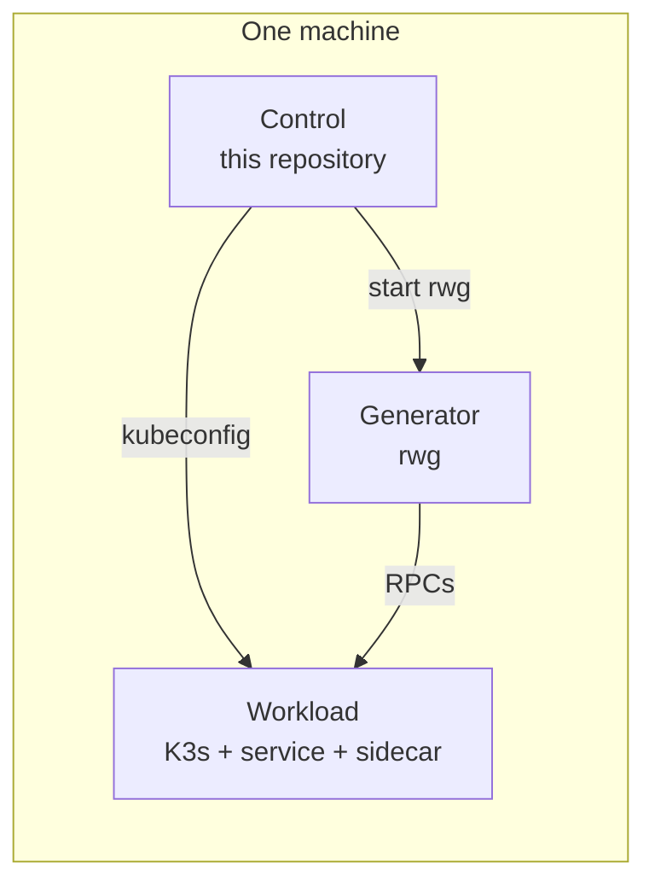
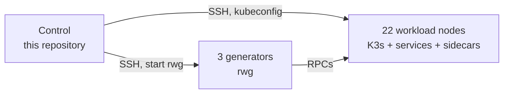

# Roshanfer artifact — EuroSys 2027

This repository is the experiment harness for:

**Roshanfer: Achieving Performance Resilience in Cloud Microservices.** Farzad Mohammadi et al. EuroSys 2027 (paper #1195).

We are submitting this artifact for the ACM / EuroSys 2027 badges **Available**, **Functional**, and **Reproduced**.

This README has two independent parts:

1. **Tutorial** — one machine. Explains the repository layout and how a benchmark is built and run. It is not a reproduction of the paper figures.
2. **Reproducing the paper** — the CloudLab configuration used in the evaluation. Use this part only when the goal is to regenerate the paper results.

Artifact-evaluation work is on the `artifact-evaluation` branch.

---

## Time and resource overview

> **Author TODO.** Fill in measured human time and compute time. Please do not estimate. Keep this section incomplete until those measurements exist.
>
> Tutorial (one machine):
>
> - Install, walk through `one-service`, inspect a plot:
>
> Paper reproduction:
>
> - Instantiate the paper CloudLab parameter set:
> - Provision K3s and build the sidecar:
> - Hotel Reservation sweep:
> - Social Network sweep:
> - Alibaba / DGG 30-MS sweep:
> - Disk space for a full campaign:

---

# Part 1 — Tutorial (one machine)

Purpose: understand the project structure and the roles of the main components. One machine is enough. Control, generator, and workload all run on it.

This part does **not** reproduce the paper figures and does **not** require CloudLab.

## Roles in a run

Every experiment, including this tutorial, uses three roles. Here they share a single host.

| Role | Tutorial | Purpose |
| --- | --- | --- |
| **Control** | this machine | Clone of this repository. Runs `run_tests.sh` / `exec.executor`, holds `KUBECONFIG`, collects logs, and produces plots. |
| **Generator** | this machine | Runs the open-loop load generator (`rwg`). Not part of the Kubernetes cluster. |
| **Workload** | this machine | Kubernetes node. Runs the microservice(s) and, when requested, a Roshanfer sidecar. |



In every hosts file, the first `num_generators` lines are generators and the remaining lines are workload nodes. The harness needs at least one generator line and one workload line (`num_generators` + 1). On one machine that is the same host written twice, with `--num-generators 1`.

## Repository layout

| Path | Role |
| --- | --- |
| `run_tests.sh` | Batch entry point. Runs suites under `configs/tests/*`, and optionally hotel, social, or alibaba. |
| `exec/` | Orchestrator: provision, deploy, generate, collect, and plot. |
| `configs/` | Per-benchmark `config.json`, `experiments.json`, and optional `merged.yaml`. |
| `benchmarks/` | Submodule. Service graphs, DeathStarBench wrappers, K3s/Cilium scripts, provisioning. |
| `rwg/` | Submodule. Go open-loop HTTP/gRPC generator. |
| `benchmarks/sidecar/` | Nested submodule. Roshanfer C++ sidecar. |

A **benchmark** is a pair: a tree under `benchmarks/` that builds and deploys the service graph, and a tree under `configs/` that describes which experiments to run.

## Build and run `one-service`

### 1. One machine

Any Linux host with SSH to itself is sufficient. It does not need to match the paper hardware.

The harness reads a hosts file and treats the first line as the generator and the second as the workload node. List the same host twice:

```text
user@localhost
user@localhost
```

`ssh user@localhost` should succeed without a password prompt (for example with an SSH key added to `~/.ssh/authorized_keys`).

### 2. Clone

```bash
git clone --recurse-submodules -b artifact-evaluation <this-repo-url>
cd roshanfer-experiments
git submodule update --init --recursive
```

If the clone was created without `--recurse-submodules`:

```bash
git submodule update --init --recursive
```

The required submodules are `benchmarks`, `rwg`, and `benchmarks/sidecar`.

### 3. Python environment and direnv

`run_tests.sh` prefers `.venv/bin/python` when it exists, otherwise `python`. It exits unless direnv has set `KUBECONFIG` to this clone’s `benchmarks/k8s/kubeconfig`.

```bash
sudo apt install direnv
echo 'eval "$(direnv hook bash)"' >> ~/.bashrc   # or zsh
source ~/.bashrc
cd /path/to/roshanfer-experiments
direnv allow

python3 -m venv .venv
source .venv/bin/activate
pip install -r requirements.txt
```

`init_env.sh` currently creates a directory named `env` and leaves `pip install` commented out. Please use the commands above until that script is updated.

### 4. What a benchmark directory contains

`configs/tests/one-service/` is the smallest example:

| File | Purpose |
| --- | --- |
| `config.json` | Bench name (`bench: tests/one-service`), SLOs, `num_generators`, paths to `rwg` and hosts. |
| `experiments.json` | List of runs: `type`, `system`, `loads`, `duration_sec`, `apis`, `repeat`. |
| `merged.yaml` | How to overlay systems on one figure (Plain vs Roshanfer). |
| `hosts.txt` | Local-mode hosts. With `--remote`, hosts come from a CloudLab manifest instead. |

Relevant fields in `config.json`:

```json
{
  "bench": "tests/one-service",
  "num_generators": 1,
  "slos": { "f1": "20" },
  "rwg_binary_path": "./rwg/rwg",
  "hosts_file": "configs/tests/one-service/hosts.txt"
}
```

Copy those two lines into `configs/tests/one-service/hosts.txt`.

A small sidecar latency sweep in `experiments.json` looks like this:

```json
{
  "type": "latency-vs-throughput",
  "system": "sidecar",
  "apis": ["f1"],
  "loads": { "start": 500, "end": 2000, "step": 500 },
  "base_rate": 500,
  "duration_sec": 10,
  "repeat": 1,
  "warmup": 2
}
```

`system` is one of `plain` (no sidecar), `sidecar` (Roshanfer), `rajomon`, or `dagor`.

To add another example, copy the directory, edit `config.json` and `experiments.json`, and run `--bench my-example`. A new service graph belongs under `benchmarks/`; point `bench` at it.

### 5. Experiment types

These names appear in `experiments.json` and in `run_tests.sh --type`. They describe *what* a run measures. They are reused later for paper figures, but the tutorial only needs to show that each type is a different measurement.

| Type | Measurement |
| --- | --- |
| `latency-vs-throughput` | Latency versus offered load |
| `latency-and-goodput-vs-load` | P99 latency and goodput as load increases |
| `latency-and-rate-vs-time` | Time series after a load step (200 ms windows) |
| `max-queue` / `max-queue-motivation` | Per-service queue depth |
| `resource-waste` | Fraction of completed work that is later dropped or misses its SLO |

Fields that usually matter: `system`, `apis`, `loads.start` / `end` / `step`, `duration_sec`, `warmup`, `repeat`, and `slos` in `config.json`.

### 6. Run the example

```bash
./run_tests.sh \
  --bench one-service \
  --num-generators 1 \
  --comment tutorial
```

This uses `configs/tests/one-service/hosts.txt` (local mode, no CloudLab manifest). The script writes `exp_runs_test/<run_id>/one-service/` and plots under `exp_runs_test/<run_id>/plots/one-service/`. A later invocation creates a new timestamped directory.

### 7. Inspect output

```bash
ls exp_runs_test/*/one-service/exp-one-service/
ls exp_runs_test/*/plots/one-service/
```

Per-repeat metrics are under `…/repeat_000/output/` (`overall-*.json`, `realtime-*.csv`). Overlay plots are under `plots/one-service/merged/` when `merged.yaml` is present.

If filters exclude every experiment, plotting is skipped and a short message is printed. Missing or unknown flags print the usage text and exit.

---

# Part 2 — Reproducing the paper

Purpose: regenerate the evaluation in the paper. This is separate from the tutorial. It requires the CloudLab configuration below. We have not validated other hardware types or node counts.

For AEC access we will collect SSH public keys (please omit the `user@host` comment). CloudLab account passwords are not required. Discussion should go through HotCRP.

## Paper environment

| Item | Value used in the paper |
| --- | --- |
| CloudLab profile | [PortalProfiles/small-lan](https://www.cloudlab.us/p/PortalProfiles/small-lan) |
| Parameter set | [f369c1b9-2eff-425f-b5ce-d7493a17fd76](https://www.cloudlab.us/p/PortalProfiles/small-lan&rerun_paramset=f369c1b9-2eff-425f-b5ce-d7493a17fd76) |
| Hardware | CloudLab `c220g2` |
| Roles | 1 control, 3 generators, 22 workload |
| Cluster | K3s and Cilium, via `benchmarks/k8s/` (`K3S_VERSION` and `CILIUM_VERSION` in `benchmarks/k8s/config.env`) |
| Sidecar | C++, `ubuntu:noble` in the sidecar Dockerfile |
| Python | versions pinned in `requirements.txt` |



## Instantiate and clone

1. Open the parameter set above and instantiate it so the hardware type and node count match the paper.
2. Wait until all nodes are ready, then download the experiment manifest XML.
3. On the control machine:

```bash
git clone --recurse-submodules -b artifact-evaluation <this-repo-url>
cd roshanfer-experiments
git submodule update --init --recursive

sudo apt install direnv
echo 'eval "$(direnv hook bash)"' >> ~/.bashrc
source ~/.bashrc
direnv allow

python3 -m venv .venv
source .venv/bin/activate
pip install -r requirements.txt

python -m exec.cloudlab_hosts --manifest ./manifest.xml -o ./cloudlab_hosts.txt --ssh-user YOUR_CLOUDLAB_USER
```

With `--num-generators 3`, the first three hosts are generators and the remaining 22 are workload nodes.

## Artifact map

| Component | Location | Paper |
| --- | --- | --- |
| Roshanfer sidecar (Agent, Ingress, and credit protocol) | `benchmarks/sidecar/` | Design and implementation (§3–§5) |
| Experiment orchestrator | `exec/`, `run_tests.sh` | Evaluation (§6) |
| Open-loop generator | `rwg/` | §6.1 |
| Hotel Reservation and Social Network | `configs/hotel/`, `configs/social/`, plus `benchmarks/` | Figures 7–11, 14 |
| Alibaba / DGG 30-MS and dynamic graphs | `configs/alibaba-large/`, `configs/tests/dynamic-large/`, `fan-out-dynamic-*` | Figures 12–13 |
| Rajomon and Dagor baselines | `system: rajomon` / `dagor` in `experiments.json` | §6 |
| TLA+ model | **Author TODO.** Add the specification link. | §5 (Request Bound, Deadlock Freedom, Work Conservation) |

## How to run the paper experiments

The paper results come from a full run of each benchmark below. Each command executes every experiment in that bench’s `experiments.json`. After the runs finish, the paper figures are taken from those outputs (see the next section).

The following commands assume `manifest.xml` is in the repository root and the virtualenv from the previous section is active.

**Hotel Reservation**

```bash
./run_tests.sh --remote --cloudlab-manifest ./manifest.xml \
  --num-generators 3 --cloudlab-ssh-user YOUR_CLOUDLAB_USER \
  --bench hotel --also-hotel-social
```

**Social Network**

```bash
./run_tests.sh --remote --cloudlab-manifest ./manifest.xml \
  --num-generators 3 --cloudlab-ssh-user YOUR_CLOUDLAB_USER \
  --bench social --also-hotel-social
```

**Alibaba / DGG 30-MS**

```bash
./run_tests.sh --remote --cloudlab-manifest ./manifest.xml \
  --num-generators 3 --cloudlab-ssh-user YOUR_CLOUDLAB_USER \
  --bench alibaba-large --also-alibaba
```

**Dynamic graphs**

```bash
./run_tests.sh --remote --cloudlab-manifest ./manifest.xml \
  --num-generators 3 --cloudlab-ssh-user YOUR_CLOUDLAB_USER \
  --bench dynamic-large
```

```bash
./run_tests.sh --remote --cloudlab-manifest ./manifest.xml \
  --num-generators 3 --cloudlab-ssh-user YOUR_CLOUDLAB_USER \
  --bench fan-out-dynamic-0-9
```

Each invocation writes a new `exp_runs_test/<timestamp>/` directory. Plots are under `exp_runs_test/<timestamp>/plots/<bench>/`. Overlay plots use each bench’s `merged.yaml` (labels Roshanfer, Rajomon, Dagor, Plain).

Hotel, social, and alibaba in one invocation (this does not include the dynamic-graph benches):

```bash
./run_tests.sh --remote --cloudlab-manifest ./manifest.xml \
  --num-generators 3 --cloudlab-ssh-user YOUR_CLOUDLAB_USER \
  --also-hotel-social --also-alibaba
```

## Which figures come from which run

The paper figures were selected from the full bench outputs above, not from a separate command per figure.

| Paper figure | Full run | Measurement in that output |
| --- | --- | --- |
| Figs. 1–2 (motivation) | Hotel | `latency-and-rate-vs-time`, `max-queue-motivation`, `resource-waste` (rajomon) |
| Fig. 7 | Hotel and Social | `latency-and-goodput-vs-load` (hotel `search-hotel`, social `compose-post`) |
| Fig. 8 | Hotel | `latency-and-rate-vs-time` |
| Fig. 9 | Hotel and Social | `resource-waste` |
| Fig. 10 | Hotel and Social | `max-queue` |
| Fig. 11 | Social | `latency-and-goodput-vs-load` (three APIs) |
| Fig. 12 | Dynamic graphs (`dynamic-large` and `fan-out-dynamic-0-9`) | `latency-and-goodput-vs-load` |
| Fig. 13 | Alibaba / DGG 30-MS | `latency-and-goodput-vs-load` |
| Fig. 14 | Hotel | `latency-vs-throughput` (plain, sidecar) |

> **Author TODO.** Confirm this mapping against the paper. Figure 15 (overcommitment / WRR) is not listed yet.

## Expected warnings and errors

> **Author TODO.** Careful pass over the paper-reproduction commands (CloudLab instantiate, clone, direnv, virtualenv, manifest parsing, hotel, social, alibaba). For each step, record expected messages, genuine failures and the recovery step, and what a successful run prints. Please write this from observed output.

## Troubleshooting

> **Author TODO.** Same pass. Please cover at least: direnv / `KUBECONFIG`, SSH user mismatch, uninitialized submodules, the `~/.roshanfer_provisioned` marker, `--remote-clean`, skipped plots, and Rajomon tuner duration.

---

## License

License files are not yet in the tree. We plan to add a license that permits comparison and extension (MIT or CC-BY), as required for Available.

`exec/README.md` describes tuners, git worktrees, and additional plot flags.
