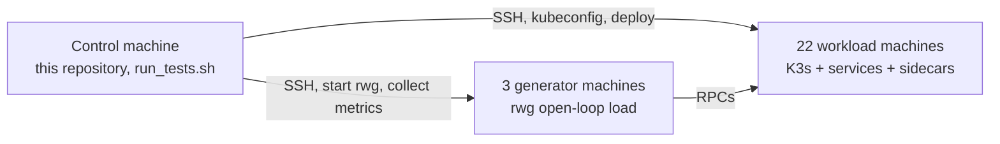

# Roshanfer artifact — EuroSys 2027

This repository is the experiment harness for:

**Roshanfer: Achieving Performance Resilience in Cloud Microservices.** Farzad Mohammadi et al. EuroSys 2027 (paper #1195).

We are submitting this artifact for the ACM / EuroSys 2027 badges **Available**, **Functional**, and **Reproduced**.

The paper results were obtained on CloudLab `c220g2` machines: 1 control node, 3 generators, and 22 workload nodes. That configuration is the [small-lan](https://www.cloudlab.us/p/PortalProfiles/small-lan) profile with parameter set [f369c1b9-2eff-425f-b5ce-d7493a17fd76](https://www.cloudlab.us/p/PortalProfiles/small-lan&rerun_paramset=f369c1b9-2eff-425f-b5ce-d7493a17fd76). Reproducing the paper figures requires this setup. We have not validated other hardware types or node counts.

Artifact-evaluation work is on the `artifact-evaluation` branch.

---

## Time and resource overview

> **Author TODO.** Fill in measured human time and compute time for each step. Please do not estimate. This section should stay incomplete until those measurements exist.
>
> Suggested rows:
>
> - Getting started / kick-the-tires (`one-service` tutorial): _human-min + compute-min_
> - Instantiate CloudLab and wait for nodes:
> - Provision K3s and build the sidecar:
> - Hotel Reservation paper sweep (`--also-hotel-social`):
> - Social Network paper sweep:
> - Alibaba / DGG 30-MS sweep (`--also-alibaba`):
> - Disk space for a full campaign:

---

## Architecture and repository layout

Each paper experiment uses three roles.

| Role | Count | Purpose |
| --- | --- | --- |
| **Control** | 1 | Machine where this repository is cloned. Runs `run_tests.sh` / `exec.executor`, holds `KUBECONFIG`, collects logs, and produces plots. |
| **Generators** | 3 | Run the open-loop load generator (`rwg`). These nodes are not part of the Kubernetes cluster. |
| **Workload** | 22 | Kubernetes nodes. They run the microservices together with Roshanfer sidecars, or Rajomon, Dagor, or a plain deployment. |



In every hosts file, the first `num_generators` lines are generator nodes and the remaining lines are workload (Kubernetes) nodes. For the paper setup that is 3 generators and 22 workload nodes.

### Repository layout

| Path | Role |
| --- | --- |
| `run_tests.sh` | Batch entry point. Runs the suites under `configs/tests/*`, and optionally hotel, social, or alibaba. |
| `exec/` | Orchestrator: provision, deploy, generate, collect, and plot. |
| `configs/` | Per-benchmark `config.json`, `experiments.json`, and optional `merged.yaml`. |
| `benchmarks/` | Submodule. Call graphs, DeathStarBench wrappers, K3s/Cilium scripts, and provisioning. |
| `rwg/` | Submodule. Go open-loop HTTP/gRPC generator. |
| `benchmarks/sidecar/` | Nested submodule. Roshanfer C++ sidecar (the system described in the paper). |

A **benchmark** is a pair: a tree under `benchmarks/` that builds and deploys the service graph, and a tree under `configs/` that describes which experiments to run.

---

## Tutorial: build and run an example from scratch

This is the recommended first path (kick-the-tires). The goal is to instantiate the cluster, clone the repository, install dependencies, run the small `one-service` benchmark, and inspect a plot.

Active time should be a small number of commands. Compute time is an **Author TODO**.

### 1. Instantiate CloudLab

1. Open the parameter set used in the paper: [small-lan rerun_paramset](https://www.cloudlab.us/p/PortalProfiles/small-lan&rerun_paramset=f369c1b9-2eff-425f-b5ce-d7493a17fd76).
2. Instantiate that parameter set so that the hardware type and node count match the paper.
3. Wait until all nodes are ready.
4. Download the experiment **manifest** XML from the CloudLab portal. Pass that file to `run_tests.sh`.

For AEC access we will collect SSH public keys (please omit the `user@host` comment). CloudLab account passwords are not required. Discussion should go through HotCRP.

### 2. Clone on the control machine

```bash
git clone --recurse-submodules -b artifact-evaluation <this-repo-url>
cd roshanfer-experiments
git submodule update --init --recursive
```

If the clone was created without `--recurse-submodules`:

```bash
git submodule update --init --recursive
```

The required submodules are `benchmarks`, `rwg`, and the nested `benchmarks/sidecar`.

### 3. Python environment and direnv

`run_tests.sh` prefers `.venv/bin/python` when that interpreter exists, otherwise `python`. It exits unless direnv has set `KUBECONFIG` to this clone’s `benchmarks/k8s/kubeconfig`.

```bash
sudo apt install direnv
echo 'eval "$(direnv hook bash)"' >> ~/.bashrc   # or zsh
source ~/.bashrc
cd /path/to/roshanfer-experiments
direnv allow

python3 -m venv .venv
source .venv/bin/activate
pip install -r requirements.txt
```

`init_env.sh` currently creates a directory named `env` and leaves `pip install` commented out. Please use the commands above until that script is updated.

### 4. Manifest to host list

```bash
python -m exec.cloudlab_hosts --manifest ./manifest.xml -o ./cloudlab_hosts.txt --ssh-user YOUR_CLOUDLAB_USER
```

The output is one `[user@]host` per line, in CloudLab `node0`, `node1`, … order. With `--num-generators 3`, the first three lines are generators and the remaining 22 are workload nodes.

### 5. Anatomy of a benchmark directory

`configs/tests/one-service/` is the smallest example:

| File | Purpose |
| --- | --- |
| `config.json` | Bench name (`bench: tests/one-service`), SLOs, `num_generators`, and paths to `rwg` and hosts. |
| `experiments.json` | List of runs: `type`, `system`, `loads`, `duration_sec`, `apis`, `repeat`. |
| `merged.yaml` | How to overlay systems on one figure (Plain vs Roshanfer). |
| `hosts.txt` | Used only in local mode. With `--remote`, hosts come from the CloudLab manifest instead. |

Relevant fields in `config.json`:

```json
{
  "bench": "tests/one-service",
  "num_generators": 1,
  "slos": { "f1": "20" },
  "rwg_binary_path": "./rwg/rwg"
}
```

An `experiments.json` entry selects an experiment type (next section). A small sidecar latency sweep looks like this:

```json
{
  "type": "latency-vs-throughput",
  "system": "sidecar",
  "apis": ["f1"],
  "loads": { "start": 500, "end": 2000, "step": 500 },
  "base_rate": 500,
  "duration_sec": 10,
  "repeat": 1,
  "warmup": 2
}
```

`system` is one of `plain` (no sidecar), `sidecar` (Roshanfer), `rajomon`, or `dagor`.

To add another example benchmark, copy this directory:

```bash
cp -r configs/tests/one-service configs/tests/my-example
# edit configs/tests/my-example/config.json   (bench, slos, num_generators)
# edit configs/tests/my-example/experiments.json
# for a new service graph, add it under benchmarks/ and point bench at it
```

Then run only that bench with `--bench my-example`.

### 6. Run the example

Remote run of `one-service` with the paper host split:

```bash
./run_tests.sh \
  --bench one-service \
  --remote \
  --cloudlab-manifest ./manifest.xml \
  --num-generators 3 \
  --cloudlab-ssh-user YOUR_CLOUDLAB_USER \
  --comment kick-the-tires
```

`--num-generators 3` is the paper assignment. The `one-service` config defaults to 1 generator if the flag is omitted.

The script:

1. Writes `exp_runs_test/<run_id>/cloudlab_hosts.txt` from the manifest.
2. Runs `python -m exec.executor` on `configs/tests/one-service/`.
3. Stores data under `exp_runs_test/<run_id>/one-service/`.
4. Writes plots to `exp_runs_test/<run_id>/plots/one-service/` and a combined PDF under `plots/`.

`<run_id>` is `YYYYMMDD_HHMMSS`, optionally followed by `_comment`. A later invocation creates a new directory and leaves the previous run in place.

### 7. Inspect results and plots

```bash
ls exp_runs_test/*/one-service/exp-one-service/
ls exp_runs_test/*/plots/one-service/
ls exp_runs_test/*/plots/all_tests_plots.pdf
```

Per-repeat metrics are under `…/repeat_000/output/` (`overall-*.json`, `realtime-*.csv`). Overlay plots (Plain vs Roshanfer) are under `plots/one-service/merged/` when `merged.yaml` is present.

If filters exclude every experiment, `run_tests.sh` skips plotting and prints a short message. Missing or unknown flags print the usage text and exit.

---

## Experiment types and configuration

`run_tests.sh --type` and the `type` field in `experiments.json` use the following names.

| Type | Measurement | Typical use in the paper |
| --- | --- | --- |
| `latency-vs-throughput` | Latency versus offered load below the overload-control regime | Figure 14 (overhead versus Plain) |
| `latency-and-goodput-vs-load` | P99 latency and goodput as load increases through and beyond capacity | Figures 7, 11, 12, 13 |
| `latency-and-rate-vs-time` | Time series after a load step (P99 and rates in 200 ms windows) | Figure 8; motivation Figures 1–2 |
| `max-queue` / `max-queue-motivation` | Per-service queue depth under overload | Figures 1b, 10 |
| `resource-waste` | Fraction of completed work that is later dropped or misses its SLO | Figures 2b, 9 |

Fields that determine the experimental claim (other fields can remain at their defaults for a first run):

- `system`: `plain`, `sidecar`, `rajomon`, or `dagor`
- `apis`: entry APIs (for example `search-hotel`, `compose-post`, `f1`)
- `loads.start` / `end` / `step`: offered-load grid in requests per second
- `duration_sec`, `warmup`, `repeat`
- `slos` in `config.json` (paper rule: five times the unloaded P99)
- `num_generators` / `--num-generators`
- `--also-hotel-social` and `--also-alibaba` (paper benchmarks; not part of the default `configs/tests/*` walk)

`./run_tests.sh` with no extra flags runs only `configs/tests/*` (synthetic graphs). Paper figures use:

```bash
./run_tests.sh --remote --cloudlab-manifest ./manifest.xml \
  --num-generators 3 --cloudlab-ssh-user YOUR_CLOUDLAB_USER \
  --also-hotel-social --also-alibaba
```

Individual benches: `--bench hotel --also-hotel-social`, `--bench social --also-hotel-social`, `--bench alibaba-large --also-alibaba`.

---

## Artifact map

| Component | Location | Paper |
| --- | --- | --- |
| Roshanfer sidecar (Agent, Ingress, and credit protocol) | `benchmarks/sidecar/` | Design and implementation (§3–§5) |
| Experiment orchestrator | `exec/`, `run_tests.sh` | Evaluation (§6) |
| Open-loop generator | `rwg/` | §6.1 |
| Hotel Reservation and Social Network | `configs/hotel/`, `configs/social/`, plus `benchmarks/` | Figures 7–11, 14 |
| Alibaba / DGG 30-MS and dynamic graphs | `configs/alibaba-large/`, `configs/tests/dynamic-large/`, `fan-out-dynamic-*` | Figures 12–13 |
| Rajomon and Dagor baselines | `system: rajomon` / `dagor` in `experiments.json` | §6 |
| TLA+ model | **Author TODO.** Add the specification link. Please do not insert a placeholder URL. | §5 (Request Bound, Deadlock Freedom, Work Conservation) |

---

## Environment

| Item | Value used in the paper |
| --- | --- |
| CloudLab profile | [PortalProfiles/small-lan](https://www.cloudlab.us/p/PortalProfiles/small-lan) |
| Parameter set | [f369c1b9-2eff-425f-b5ce-d7493a17fd76](https://www.cloudlab.us/p/PortalProfiles/small-lan&rerun_paramset=f369c1b9-2eff-425f-b5ce-d7493a17fd76) |
| Hardware | CloudLab `c220g2` |
| Roles | 1 control, 3 generators, 22 workload |
| Cluster | K3s and Cilium, via `benchmarks/k8s/` (`K3S_VERSION` and `CILIUM_VERSION` in `benchmarks/k8s/config.env`) |
| Sidecar | C++, `ubuntu:noble` in the sidecar Dockerfile |
| Python | versions pinned in `requirements.txt` |
| Control machine | Linux with SSH, direnv, Python 3, and the virtualenv above |

This artifact is intended for the CloudLab configuration in the table.

---

## Figures and commands

The commands below assume the tutorial has been completed through the manifest step.

| Paper figure | Bench | Type | Systems | Flags |
| --- | --- | --- | --- | --- |
| Fig. 7 | `hotel` (`search-hotel`), `social` (`compose-post`) | `latency-and-goodput-vs-load` | sidecar, rajomon, dagor | `--bench hotel --also-hotel-social` and `--bench social --also-hotel-social` |
| Fig. 8 | `hotel` | `latency-and-rate-vs-time` | sidecar, rajomon, dagor | same hotel command |
| Fig. 9 | `hotel` / `social` | `resource-waste` | sidecar, rajomon, dagor | same |
| Fig. 10 | `hotel` / `social` | `max-queue` | sidecar, rajomon, dagor | same |
| Fig. 11 | `social` (three APIs) | `latency-and-goodput-vs-load` | sidecar, rajomon, dagor | `--bench social --also-hotel-social` |
| Fig. 12 | dynamic-graph tests | `latency-and-goodput-vs-load` | sidecar, rajomon, dagor | `--bench dynamic-large` or `fan-out-dynamic-0-9` |
| Fig. 13 | `alibaba-large` | `latency-and-goodput-vs-load` | sidecar, rajomon, dagor | `--bench alibaba-large --also-alibaba` |
| Fig. 14 | `hotel` | `latency-vs-throughput` | plain, sidecar | `--bench hotel --also-hotel-social` |
| Figs. 1–2 (motivation) | `hotel` | `latency-and-rate-vs-time`, `max-queue-motivation`, `resource-waste` | rajomon | `--bench hotel --also-hotel-social` |

> **Author TODO.** Confirm this table against the paper. Figure 15 (overcommitment / WRR) is not listed as a `--bench` name yet.

Plots are produced by `exec.plot_runner` and `exec.merged_plot_runner` using each bench’s `merged.yaml` (labels Roshanfer, Rajomon, Dagor, Plain).

Each `run_tests.sh` invocation writes a new `exp_runs_test/<timestamp>/` directory. If the executor is pointed at an existing unit directory, it appends additional `repeat_*` folders. A fresh `run_tests.sh` invocation is the simpler option.

### Expected warnings and errors

> **Author TODO.** This section needs a careful pass over every command an evaluator will run (CloudLab instantiate, clone, direnv, virtualenv, manifest parsing, `one-service`, hotel, social, alibaba). For each step, record:
>
> - messages that look like errors but are expected
> - genuine failures and the recovery step
> - what a successful run prints
>
> Please write this from observed output rather than from memory.

---

## Troubleshooting

> **Author TODO.** Same pass as expected warnings. Please cover at least: direnv / `KUBECONFIG`, SSH user mismatch, uninitialized submodules, the `~/.roshanfer_provisioned` marker, `--remote-clean`, skipped plots, and Rajomon tuner duration.
>
> Please write this from observed behavior.

---

## License

License files are not yet in the tree. We plan to add a license that permits comparison and extension (MIT or CC-BY), as required for Available.

---

`exec/README.md` describes tuners, git worktrees, and additional plot flags. This file is the evaluator path.
