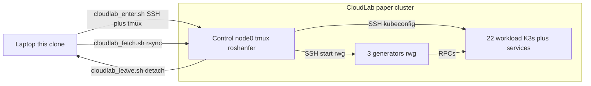

# Roshanfer artifact — EuroSys 2027

This repository is the artifact for:

**Roshanfer: Achieving Performance Resilience in Cloud Microservices.** Farzad Mohammadi, Theo Akande, and Marios Kogias. EuroSys 2027 (paper #1195). [citation](#citation).

We are submitting this artifact for the ACM / EuroSys 2027 badges **Available**, **Functional**, and **Reproduced**.

This README is sequential:

1. **Part 1 — Tutorial (CloudLab)** — instantiate the paper cluster, initialize the control node, and run a small experiment (`one-service`). That is the same environment used in Part 2.
2. **Part 2 — Reproducing the paper** — assumes Part 1 is done. Regenerates the paper figures on that cluster.

Artifact-evaluation work is on the `artifact-evaluation` branch.

## Repository layout

A **benchmark** is a pair: a service graph under `benchmarks/` and a config tree under `configs/`. `run_tests.sh` runs that pair.

The work lives in three git submodules:

| Submodule | Role |
| --- | --- |
| `benchmarks/` | Service graphs (Hotel, Social, Alibaba, synthetic tests) and cluster scripts (K3s, host bootstrap). |
| `benchmarks/sidecar/` | Nested under `benchmarks/`. Roshanfer C++ sidecar (Agent, Ingress, credit protocol). |
| `rwg/` | Open-loop HTTP/gRPC load generator. Runs on generator nodes, not in Kubernetes. |

```text
roshanfer-experiments/
├── run_tests.sh                   run a benchmark
├── init_env.sh                    Python venv + KUBECONFIG
├── config.env.example             copy to config.env
├── scripts/cloudlab_enter.sh      laptop → control node
├── scripts/cloudlab_leave.sh      control → laptop
├── scripts/cloudlab_fetch.sh      laptop ← exp_runs_test from control
├── scripts/fetch_manifest.sh      write manifest.xml on the control node
├── exec/                          orchestrator: provision, deploy, generate, plot
├── configs/                       what to run (one directory per benchmark)
│   ├── tests/one-service/         tutorial
│   ├── hotel/                     Hotel Reservation (Figs. 7–11, 14)
│   ├── social/                    Social Network (Figs. 7, 9–11)
│   ├── alibaba-large/             Alibaba / DGG 30-MS (Fig. 13)
│   └── tests/                     other synthetic graphs (Figs. 12, 15)
├── benchmarks/                    submodule: apps + K3s/provisioning
│   └── sidecar/                   nested submodule: Roshanfer C++ sidecar
└── rwg/                           submodule: load generator
```

Each `configs/<bench>/` directory has `config.json` (which graph, SLOs), `experiments.json` (what to measure), and often `merged.yaml` (how to overlay systems on one plot). `system` in `experiments.json` is `plain`, `sidecar` (Roshanfer), `rajomon`, or `dagor`.

---

## Time and resource overview

> **Author TODO.** Fill in measured human time and compute time. Please do not estimate. Keep this section incomplete until those measurements exist.
>
> Tutorial (CloudLab, same cluster as the paper):
>
> - Instantiate the paper CloudLab parameter set:
> - First provision, K3s, and `one-service`:
>
> Paper reproduction (cluster already up from Part 1):
>
> - Hotel Reservation sweep:
> - Social Network sweep:
> - Alibaba / DGG 30-MS sweep:
> - Dynamic-graph sweep (`dynamic-large`, `fan-out-dynamic-0-9`):
> - Figure 15 leaf benches (`leaf-1-2`, `leaf-1-10`, `leaf-1-2-p-2-1`):
> - Disk space for a full campaign:

---

# Part 1 — Tutorial (CloudLab)

Purpose: set up the paper cluster, initialize the repo on the control node, and run a simple experiment. After this part the cluster is ready for figure reproduction.

We have not validated other hardware types or node counts.

## Roles and machines

| Role | Where | Purpose |
| --- | --- | --- |
| **Laptop** | your machine | Clone of this repository. Used to enter and leave the control node, and to fetch `exp_runs_test/` (PDFs and results). |
| **Control** | CloudLab `node0` | Clone of this repository. Runs experiments, collects logs, produces plots. |
| **Generator** | 3 CloudLab nodes | Runs `rwg` (load generator). Not in Kubernetes. |
| **Workload** | 22 CloudLab nodes | Kubernetes nodes. Run services and, when requested, the Roshanfer sidecar. |



## Paper environment

Part 2 uses this same experiment.

| Item | Value used in the paper |
| --- | --- |
| CloudLab profile | [PortalProfiles/small-lan](https://www.cloudlab.us/p/PortalProfiles/small-lan) |
| Parameter set | [f369c1b9-2eff-425f-b5ce-d7493a17fd76](https://www.cloudlab.us/p/PortalProfiles/small-lan&rerun_paramset=f369c1b9-2eff-425f-b5ce-d7493a17fd76) |
| Hardware | CloudLab `c220g2` |
| Roles | 1 control, 3 generators, 22 workload |
| Cluster | K3s and Cilium |
| Sidecar | C++, `ubuntu:noble` |
| Python | 3.12 |

> [!NOTE]
> You need a GitHub account with a normal OpenSSH public key added to it. PuTTY `.ppk` and FIDO/hardware keys do not work.

## Setup

Each step lists **where** to run it, **what** it does, and **what to expect**.

### 1. Instantiate the CloudLab experiment

**Where:** browser (CloudLab portal).

**What:** open the parameter set above and instantiate it.

**Expected:** all 26 nodes show Ready. Note the experiment **Name** and **Project**.

### 2. Clone on the laptop

**Where:** laptop.

**What:** get the enter/leave scripts. The control node gets a full clone (with submodules) in the next step.

```bash
git clone -b artifact-evaluation <this-repo-url>
cd roshanfer-experiments
```

**Expected:** `scripts/cloudlab_enter.sh` exists.

### 3. Enter the control node

**Where:** laptop, from this clone.

**What:** SSH to `node0`, clone the repo into `~/roshanfer-experiments`, attach tmux session `roshanfer`.

```bash
./scripts/cloudlab_enter.sh --name NAME --project PROJECT --user USER
# default --url wisc.cloudlab.us
```

`NAME` and `PROJECT` are on the CloudLab experiment page. `--user` is your CloudLab username. You need a normal OpenSSH GitHub key on the laptop (not PuTTY `.ppk` and not a FIDO/hardware key).

**Expected:** tmux session `roshanfer`, cwd `~/roshanfer-experiments`.

### 4. Fetch the experiment manifest

**Where:** control node (inside tmux).

**What:** write `manifest.xml` (needed by `--remote`).

```bash
./scripts/fetch_manifest.sh
```

**Expected:** `Wrote ./manifest.xml`.

### 5. Configure once

**Where:** control node.

**What:** create `config.env` and set your CloudLab username.

```bash
cp config.env.example config.env
# Set CLOUDLAB_SSH_USER to the same CloudLab username you passed to cloudlab_enter.sh.
```

**Expected:** `config.env` exists with `CLOUDLAB_SSH_USER` set.

### 6. Run a simple experiment

**Where:** control node.

**What:** provision hosts, create the Kubernetes cluster, and run one time-series experiment with a single API.

The flags `--type` and `--num-apis` select this entry in `configs/tests/one-service/experiments.json`:

```json
{
    "type": "latency-and-rate-vs-time",
    "loads": { "start": 5000, "end": 5000, "step": 1000 },
    "duration_sec": 15,
    "apis": ["f1"],
    "system": "sidecar",
    "repeat": 2
}
```

That is a 15 s sidecar run of API `f1` at 5000 RPS, twice. Other entries in the same file (more APIs, other `type`s) are skipped.

The service graph is generated from `benchmarks/tests/one-service/callgraph.json` (one `frontend` with APIs `f1`–`f3`). `benchmarks/callgraph-framework` turns that JSON into Go services and Kubernetes manifests. You do not need to generate or build anything now; the images are already published.

```json
{
    "id": "frontend",
    "interfaces": [
        { "name": "f1", "avg_rt": 1, "slo": 20 }
    ]
}
```

```bash
./run_tests.sh --remote --num-generators 3 \
  --bench one-service \
  --type latency-and-rate-vs-time --num-apis 1 \
  --comment tutorial
```

**Expected:** `Run directory: exp_runs_test/<id>_tutorial/`, then provisioning (`All hosts provisioned successfully.`), then K3s setup, then plots under `exp_runs_test/<id>_tutorial/plots/one-service/`.

### 7. Inspect output

**Where:** control node.

**What:** look at the run directory and plots.

```bash
ls exp_runs_test/*_tutorial/one-service/exp-one-service/
ls exp_runs_test/*_tutorial/plots/one-service/
```

**Expected:** metrics under `…/repeat_000/output/` and a time-series plot under `plots/one-service/`.

### 8. Leave the control node

**Where:** control node, inside tmux.

**What:** detach tmux. SSH exits; the session and clone stay on `node0`.

```bash
./scripts/cloudlab_leave.sh
# or Ctrl-b d
```

**Expected:** you are back on the laptop. Re-enter with the same `cloudlab_enter.sh` command.

### 9. Download results to the laptop

**Where:** laptop, from this clone (could be another terminal).

**What:** rsync `exp_runs_test/` from the control node so you can open PDFs locally.

```bash
./scripts/cloudlab_fetch.sh --name NAME --project PROJECT --user USER
# then open e.g. exp_runs_test/*_tutorial/plots/one-service/
# or the merged PDF: exp_runs_test/*_tutorial/plots/all_tests_plots.pdf
```

`--list` prints remote run folder names. `--run RUN_ID` copies one run. `--plots-only` copies only `plots/` trees (skip raw metrics).

**Expected:** `./exp_runs_test/` on the laptop matches the control node (or only its `plots/` dirs with `--plots-only`).

---

# Part 2 — Reproducing the paper

Purpose: regenerate the evaluation in the paper. This part assumes Part 1 is done. Re-attach with the same `cloudlab_enter.sh` command if you left.

For AEC access we will collect SSH public keys (please omit the `user@host` comment). CloudLab account passwords are not required. Discussion should go through HotCRP.

Same cluster as Part 1: [small-lan](https://www.cloudlab.us/p/PortalProfiles/small-lan) parameter set [f369c1b9-2eff-425f-b5ce-d7493a17fd76](https://www.cloudlab.us/p/PortalProfiles/small-lan&rerun_paramset=f369c1b9-2eff-425f-b5ce-d7493a17fd76), `c220g2`, 1 control + 3 generators + 22 workload.

## Artifact map

| Component | Location | Paper |
| --- | --- | --- |
| Roshanfer sidecar | `benchmarks/sidecar/` | Design and implementation (§3–§5) |
| Experiment orchestrator | `exec/`, `run_tests.sh` | Evaluation (§6) |
| Open-loop generator | `rwg/` | §6.1 |
| Hotel Reservation and Social Network | `configs/hotel/`, `configs/social/` | Figures 7–11, 14 |
| Alibaba / DGG 30-MS and dynamic graphs | `configs/alibaba-large/`, `configs/tests/dynamic-large/`, `fan-out-dynamic-*` | Figures 12–13 |
| Overcommitment (Fig. 15) | `configs/tests/leaf-1-2/`, `leaf-1-10/`, `leaf-1-2-p-2-1/` | Figure 15 |
| Rajomon and Dagor baselines | `system: rajomon` / `dagor` in `experiments.json` | §6 |
| TLA+ model | **Author TODO.** Add the specification link. | §5 (Request Bound, Deadlock Freedom, Work Conservation) |

## How to run the paper experiments

Run these on the control node (inside tmux). Each command runs every experiment in that bench. Figures come from those outputs (next section).

**Hotel Reservation**

```bash
./run_tests.sh --remote --num-generators 3 \
  --bench hotel --also-hotel-social
```

**Social Network**

```bash
./run_tests.sh --remote --num-generators 3 \
  --bench social --also-hotel-social
```

**Alibaba / DGG 30-MS**

```bash
./run_tests.sh --remote --num-generators 3 \
  --bench alibaba-large --also-alibaba
```

**Dynamic graphs**

```bash
./run_tests.sh --remote --num-generators 3 \
  --bench dynamic-large
```

```bash
./run_tests.sh --remote --num-generators 3 \
  --bench fan-out-dynamic-0-9
```

**Figure 15**

```bash
./run_tests.sh --remote --num-generators 3 \
  --bench leaf-1-2
```

```bash
./run_tests.sh --remote --num-generators 3 \
  --bench leaf-1-10
```

```bash
./run_tests.sh --remote --num-generators 3 \
  --bench leaf-1-2-p-2-1
```

Each invocation writes `exp_runs_test/<timestamp>/` with plots under `plots/<bench>/`.

Hotel, social, and alibaba in one invocation (not the dynamic-graph or Fig. 15 benches):

```bash
./run_tests.sh --remote --num-generators 3 \
  --also-hotel-social --also-alibaba
```

From the laptop clone, pull those outputs the same way as in Part 1 step 9:

```bash
./scripts/cloudlab_fetch.sh --name NAME --project PROJECT --user USER --list
./scripts/cloudlab_fetch.sh --name NAME --project PROJECT --user USER --run RUN_ID --plots-only
```

`--plots-only` is enough to inspect paper figures. Omit it to also copy metrics under `repeat_*/output/`.

## Which figures come from which run

The paper figures were selected from the full bench outputs above, not from a separate command per figure.

| Paper figure | Full run | Measurement in that output |
| --- | --- | --- |
| Figs. 1–2 (motivation) | Hotel | `latency-and-rate-vs-time`, `max-queue-motivation`, `resource-waste` (rajomon) |
| Fig. 7 | Hotel and Social | `latency-and-goodput-vs-load` (hotel `search-hotel`, social `compose-post`) |
| Fig. 8 | Hotel | `latency-and-rate-vs-time` |
| Fig. 9 | Hotel and Social | `resource-waste` |
| Fig. 10 | Hotel and Social | `max-queue` |
| Fig. 11 | Social | `latency-and-goodput-vs-load` (three APIs) |
| Fig. 12 | Dynamic graphs (`dynamic-large` and `fan-out-dynamic-0-9`) | `latency-and-goodput-vs-load` |
| Fig. 13 | Alibaba / DGG 30-MS | `latency-and-goodput-vs-load` |
| Fig. 14 | Hotel | `latency-vs-throughput` (plain, sidecar) |
| Fig. 15 (first subfigure) | `leaf-1-2` | `throughput-vs-overcommitment` |
| Fig. 15 (second subfigure) | `leaf-1-10` | `throughput-vs-overcommitment` |
| Fig. 15 (third subfigure) | `leaf-1-2-p-2-1` | `throughput-vs-overcommitment` |

> **Author TODO.** Confirm this mapping against the paper.

## Expected warnings and errors

> **Author TODO.** Careful pass over the paper-reproduction commands (hotel, social, alibaba, dynamic graphs, Fig. 15). For each step, record expected messages, genuine failures and the recovery step, and what a successful run prints. Please write this from observed output.

## Troubleshooting

> **Author TODO.** Same pass. Please cover at least: direnv / `KUBECONFIG`, SSH user mismatch, uninitialized submodules, the `~/.roshanfer_provisioned` marker, `--remote-clean`, skipped plots, and Rajomon tuner duration.

---

## Local development

> **Author TODO.** Write this section. Cover running on a single Linux machine instead of CloudLab: `REQUIRE_REMOTE=0` in `config.env`, `hosts.txt` from `hosts.txt.example` (`user@host` lines; first lines are generators), omit `--remote`, and passwordless `ssh user@localhost`.

---

## Citation
Farzad Mohammadi, Theo Akande, and Marios Kogias. 2027. Roshanfer: Achieving Performance Resilience in Cloud Microservices. In *Proceedings of the 22nd European Conference on Computer Systems* (EuroSys ’27).

```bibtex
@inproceedings{mohammadi2027roshanfer,
  title     = {Roshanfer: Achieving Performance Resilience in Cloud Microservices},
  author    = {Mohammadi, Farzad and Akande, Theo and Kogias, Marios},
  booktitle = {Proceedings of the 22nd European Conference on Computer Systems},
  year      = {2027}
}
```

## Contact

Farzad Mohammadi, [f.mohammadi24@imperial.ac.uk](mailto:f.mohammadi24@imperial.ac.uk).

Questions and problems: please [open a GitHub issue](https://github.com/farzad1132/roshanfer-experments/issues) and send an email to [f.mohammadi24@imperial.ac.uk](mailto:f.mohammadi24@imperial.ac.uk)

---

## License

Original code in this repository, and in the `rwg`, `benchmarks` (except as noted below), and `benchmarks/sidecar` submodules, is under the [MIT License](LICENSE). That license allows comparison and extension, as required for the Available badge.

Third-party components keep their own licenses; see [THIRD_PARTY.md](THIRD_PARTY.md). `benchmarks/hotel/` and `benchmarks/social/` are derived from [DeathStarBench](https://github.com/delimitrou/DeathStarBench) (Apache License 2.0).

`exec/README.md` describes tuners, git worktrees, and additional plot flags.
