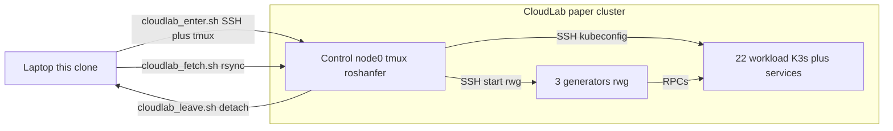

# Roshanfer artifact — EuroSys 2027

This repository is the artifact for:

**Roshanfer: Achieving Performance Resilience in Cloud Microservices.** Farzad Mohammadi, Theo Akande, and Marios Kogias. EuroSys 2027 (paper #1195). [citation](#citation).

We are submitting this artifact for the ACM / EuroSys 2027 badges **Available**, **Functional**, and **Reproduced**.

This README is sequential:

1. **Part 1 — Cluster setup and tutorial** — instantiate the paper cluster, initialize the control node, and run a small experiment (`one-service`). That is the same environment used in Part 2.
2. **Part 2 — Running paper experiments** — assumes Part 1 is done.

Artifact-evaluation work is on the `artifact-evaluation` branch.

## Repository layout

A **benchmark** is a pair: a service graph under `benchmarks/` and a config tree under `configs/`. `run_tests.sh` runs that pair.

An **experiment** is one `system`, one `type`, and one benchmark — one object in `experiments.json`. `--bench`, `--type`, and `--system` select it.

A **run** is one `./run_tests.sh` invocation (directory `exp_runs_test/<id>/`).

The CloudLab portal **Name** is a cluster, not an experiment.

The work lives in three git submodules:


| Submodule             | Role                                                                                                |
| --------------------- | --------------------------------------------------------------------------------------------------- |
| `benchmarks/`         | Service graphs (Hotel, Social, Alibaba, synthetic tests) and cluster scripts (K3s, host bootstrap). |
| `benchmarks/sidecar/` | Nested under `benchmarks/`. Roshanfer C++ sidecar (Agent, Ingress, credit protocol).                |
| `rwg/`                | Open-loop HTTP/gRPC load generator. Runs on generator nodes, not in Kubernetes.                     |


```text
roshanfer-experiments/
├── run_tests.sh                   run a benchmark
├── init_env.sh                    Python venv + KUBECONFIG
├── config.env.example             copy to config.env
├── scripts/                       helper scripts (see README)
├── scripts/cloudlab_enter.sh      laptop → control node
├── scripts/cloudlab_leave.sh      control → laptop
├── scripts/cloudlab_fetch.sh      laptop ← exp_runs_test from control
├── scripts/fetch_manifest.sh      write manifest.xml on the control node
├── scripts/pin_k8s_kernel.sh      pin Ubuntu kernel on generator + workload hosts
├── exec/                          orchestrator (see README)
├── configs/                       what to run (see README)
│   ├── tests/one-service/         tutorial
│   ├── hotel/                     Hotel Reservation (Figs. 7–11, 14)
│   ├── social/                    Social Network (Figs. 7, 9–11)
│   ├── alibaba-large/             Alibaba / DGG 30-MS (Fig. 13)
│   └── tests/                     other synthetic graphs (Figs. 12, 15)
├── benchmarks/                    submodule: apps + K3s (see README)
│   └── sidecar/                   nested submodule: C++ sidecar (see README)
└── rwg/                           submodule: load generator (see README)
```

Each `configs/<bench>/` directory has `config.json` (which graph, SLOs), `experiments.json` (what to measure), and often `merged.yaml` (how to overlay systems on one plot). `system` in `experiments.json` is `plain`, `roshanfer`, `rajomon`, or `dagor`.

---

## Time and resource overview

> **Author TODO.** Fill in measured human time and compute time. Please do not estimate. Keep this section incomplete until those measurements exist.
>
> Tutorial (CloudLab, same cluster as the paper):
>
> - Instantiate the paper CloudLab parameter set:
> - First provision, K3s, and `one-service`:
>
> Paper reproduction (cluster already up from Part 1):
>
> - Hotel Reservation sweep:
> - Social Network sweep:
> - Alibaba / DGG 30-MS sweep:
> - Dynamic-graph sweep (`dynamic-large`, `fan-out-dynamic-0-9`):
> - Figure 15 leaf benches (`leaf-1-2`, `leaf-1-10`, `leaf-1-2-p-2-1`):
> - Disk space for a full campaign:

---

# Part 1 — Cluster setup and tutorial

Purpose: set up the paper cluster, initialize the repo on the control node, and run a simple experiment. After this part the cluster is ready for figure reproduction.

We have not validated other hardware types or node counts.

## Roles and machines


| Role          | Where             | Purpose                                                                                                               |
| ------------- | ----------------- | --------------------------------------------------------------------------------------------------------------------- |
| **Laptop**    | your machine      | Clone of this repository. Used to enter and leave the control node, and to fetch `exp_runs_test/` (PDFs and results). |
| **Control**   | CloudLab `node0`  | Clone of this repository. Runs experiments, collects logs, produces plots.                                            |
| **Generator** | 3 CloudLab nodes  | Runs `rwg` (load generator). Not in Kubernetes.                                                                       |
| **Workload**  | 22 CloudLab nodes | Kubernetes nodes. Run services and, when requested, the Roshanfer sidecar.                                            |





> [!IMPORTANT]
> Each cluster can only run one experiment at a time.

## Paper environment

Part 2 uses this same cluster.


| Item             | Value used in the paper                                                                                                                        |
| ---------------- | ---------------------------------------------------------------------------------------------------------------------------------------------- |
| CloudLab profile | [PortalProfiles/small-lan](https://www.cloudlab.us/p/PortalProfiles/small-lan)                                                                 |
| Parameter set    | [f369c1b9-2eff-425f-b5ce-d7493a17fd76](https://www.cloudlab.us/p/PortalProfiles/small-lan&rerun_paramset=f369c1b9-2eff-425f-b5ce-d7493a17fd76) |
| Hardware         | CloudLab `c220g2`                                                                                                                              |
| Roles            | 1 control, 3 generators, 22 workload                                                                                                           |
| Cluster          | K3s                                                                                                                                            |
| Sidecar          | C++, `ubuntu:noble`                                                                                                                            |
| Python           | 3.12                                                                                                                                           |
| Images           | Docker Hub `farzad1132/*:latest`; `SKIP_BUILD=1`. Do not build.                                                                                |

Scripts install the rest (venv, `rwg`, host packages, K3s, images). No need to install anything manually.

> [!IMPORTANT]
> You need a GitHub account with a normal OpenSSH public key added to it. PuTTY `.ppk` and FIDO/hardware keys do not work.

## Setup

Each step lists **where** to run it, **what** it does, and **what to expect**.

### 1. Instantiate the CloudLab experiment

**Where:** browser, [CloudLab portal](https://www.cloudlab.us/). You need a CloudLab account in a project that can instantiate.

**What:** create the paper cluster from the saved parameter set. No change needed.

1. Open the parameter set used in the paper: [f369c1b9-2eff-425f-b5ce-d7493a17fd76](https://www.cloudlab.us/p/PortalProfiles/small-lan&rerun_paramset=f369c1b9-2eff-425f-b5ce-d7493a17fd76) (profile [PortalProfiles/small-lan](https://www.cloudlab.us/p/PortalProfiles/small-lan)).
2. Instantiate. Fill only what CloudLab still asks for: your **Project** and a **Name**.

The saved parameters **are the ones used for paper experiments**.

**When to proceed:** wait until the experiment status is **Ready** and **all 26 nodes** list Ready. Then copy **Name** and **Project** from that page; later steps use them as `--name` and `--project`.

**Expected:** experiment Ready, 26/26 nodes Ready, **Name** and **Project** noted.

### 2. Clone on the laptop

**Where:** laptop.

**What:** get the enter/leave scripts. The control node gets a full clone (with submodules) in the next step.

```bash
git clone -b artifact-evaluation <this-repo-url>
cd roshanfer-experiments
```

**Expected:** `scripts/cloudlab_enter.sh` exists.

### 3. Enter the control node

**Where:** laptop, from this clone.

**What:** SSH to `node0`, clone the repo into `~/roshanfer-experiments`, attach tmux session `roshanfer`.

```bash
./scripts/cloudlab_enter.sh --name NAME --project PROJECT --user USER
# default --url wisc.cloudlab.us
```

`NAME` and `PROJECT` are on the CloudLab experiment page. `--user` is your CloudLab username. You need a normal OpenSSH GitHub key on the laptop (not PuTTY `.ppk` and not a FIDO/hardware key).

**Expected:** tmux session `roshanfer`, cwd `~/roshanfer-experiments`.

Extra tmux panes do not inherit `KUBECONFIG` from `run_tests.sh`. `cloudlab_enter.sh` installs direnv and runs `direnv allow`, so a new pane in `~/roshanfer-experiments` can run `kubectl`. If `KUBECONFIG` is unset, `source ./init_env.sh`.

### 4. Fetch the experiment manifest

**Where:** control node (inside tmux).

**What:** write `manifest.xml` (needed by `--remote`).

```bash
./scripts/fetch_manifest.sh
```

**Expected:** `Wrote ./manifest.xml`.

### 5. Configure once

**Where:** control node.

**What:** create `config.env` and set your CloudLab username.

```bash
cp config.env.example config.env
```

You must set `CLOUDLAB_USER` in `config.env` to your CloudLab username (the same `--user` you passed to `cloudlab_enter.sh`).

**Expected:** `config.env` exists with `CLOUDLAB_USER` set.

### 6. Pin the Ubuntu kernel

**Where:** control node.

**What:** Recent kernel version of Ubuntu 24.04 is `6.8.0-138-generic` but this kernel has a [bug](https://bugs.launchpad.net/ubuntu/+source/linux/+bug/2162843) that prevents `io_uring` (a sidecar dependency) from registering to kernel. We avoid this issue by pinning all hosts to `6.8.0-134-generic`:

```bash
./scripts/pin_k8s_kernel.sh --kernel 6.8.0-134-generic
```

**Expected:** `All checks passed: 6.8.0-134-generic`.

### 7. Run a simple experiment

**Where:** control node.

**What:** provision hosts, create the Kubernetes cluster, and run one time-series experiment with a single API.

Running all experiments (including generation of corresponding figures) is automatied through `./run_tests.sh` (check `./run_tests.sh --help` for the full usage guide).

We can run a simple experiment with the following command:

```bash
./run_tests.sh --remote --num-generators 3 \
  --bench one-service \
  --type latency-and-rate-vs-time --num-apis 1 \
  --comment tutorial
```

The important options here are:

- `--bench`: this tell the script to only filter `one-service` benchmark (both `/tests` and `/config` include a directory named `one-service` that keep implementation and configurations, respectively)
- `--type`: filter experiments type of `latency-and-rate-vs-time`
- `num-apis`: filter experiments with 1 API
- `--comment` append `tutorial` to the directory name of the output results.

The flags `--type` and `--num-apis` select this entry in `configs/tests/one-service/experiments.json`:

```json
{
    "type": "latency-and-rate-vs-time",
    "loads": { "start": 5000, "end": 5000, "step": 1000 },
    "duration_sec": 15,
    "apis": ["f1"],
    "system": "roshanfer",
    "repeat": 2
}
```

That entry is one experiment: `system` roshanfer, `type` latency-and-rate-vs-time, benchmark `one-service`. `--num-apis 1` selects it among several `one-service` entries. It is a 15 s Roshanfer run of API `f1` at 5000 RPS, twice. Other entries in the same file (more APIs, other `type`s) are skipped.

The service graph is generated from `benchmarks/tests/one-service/callgraph.json` (one `frontend` with APIs `f1`–`f3`). `benchmarks/callgraph-framework` turns that JSON into Go services and Kubernetes artifacts. Deploy pulls pre-built images (`SKIP_BUILD=1`). No need for building anything.

```json
{
    "id": "frontend",
    "interfaces": [
        { "name": "f1", "avg_rt": 1, "slo": 20 }
    ]
}
```

**Expected:** `Run directory: exp_runs_test/<id>_tutorial/`, then provisioning (`All hosts provisioned successfully.`), then K3s setup, then plots under `exp_runs_test/<id>_tutorial/plots/one-service/`.

**When to proceed:** wait until `./run_tests.sh` has exited.

### 8. Inspect output

**Where:** control node.

**What:** files under `exp_runs_test/<id>_tutorial/`.

```bash
cat exp_runs_test/*_tutorial/one-service/exp-one-service/run_summary.csv
ls exp_runs_test/*_tutorial/one-service/exp-one-service/
ls exp_runs_test/*_tutorial/plots/one-service/
```

- `one-service/exp-one-service/run_summary.csv` — per-repeat `status` and output path
- `…/latency-and-rate-vs-time-one-service-roshanfer/<unit>/repeat_00N/output/overall-f1.json` — aggregate goodput, SLO violations, drops, errors
- `…/repeat_00N/output/realtime-f1.csv` — per-interval rate and latency (source of the PDFs)
- `plots/one-service/…/rate_vs_time_repeat_00N.pdf` — stacked rates (goodput / SLO / dropped / errors)
- `plots/one-service/…/latency_vs_time_repeat_00N.pdf` — p50/p99 vs time

### 9. Leave the control node

**Where:** control node, inside tmux.

**What:** detach tmux. SSH exits; the session and clone stay on `node0`.

```bash
./scripts/cloudlab_leave.sh
# or Ctrl-b d
```

**Expected:** you are back on the laptop. Re-enter with the same `cloudlab_enter.sh` command.

### 10. Download results to the laptop

**Where:** laptop, from this clone (could be another terminal).

**What:** rsync `exp_runs_test/` from the control node so you can open PDFs locally.

```bash
./scripts/cloudlab_fetch.sh --name NAME --project PROJECT --user USER
# then open e.g. exp_runs_test/*_tutorial/plots/one-service/
# or the merged PDF: exp_runs_test/*_tutorial/plots/all_tests_plots.pdf
```

`--list` prints remote run folder names. `--run RUN_ID` copies one run. `--plots-only` copies only `plots/` trees (skip raw metrics).

**Expected:** `./exp_runs_test/` on the laptop matches the control node (or only its `plots/` dirs with `--plots-only`).

---

# Part 2 — Running paper experiments

In this part, we run experiments to produce figures used in the paper. This part assumes Part 1 is done. Re-attach with the same `cloudlab_enter.sh` command if you left. From the laptop clone, pull outputs the same way as in Part 1 step 10 (`./scripts/cloudlab_fetch.sh`).

> [!IMPORTANT]
> **Tuning requirements of baselines**
>
> Based on the §2.3 of the paper, our baselines require tuning for any (benchmark, hardware, workload). This tuning can take 1-2 hours for every experiment in our setup. Thus, for every experiment, we also provide the option to only run Roshanfer and generate the corresponding plot.

> [!IMPORTANT]
> **Execution times**
>
> Each experiment for any system (options are roshanfer, rajomon, dagor, and plain) will take up to 6 hours to finish excluding the any required tuning. Some experiment types, such as `latency-and-rate-vs-time` (e.g., Figure 8), `max-queue` (e.g., Figure 10), and `resource-waste` (e.g., Figure 9) are much faster because they require fewer load levels.

## Goodput vs load (real-world benchmark)

The following command runs the Alibaba (30 microservices) benchmark to generate Figure 13.

**Option A: Only Roshanfer**
```bash
./run_tests.sh --remote --num-generators 3 --type latency-and-goodput-vs-load \
  --bench alibaba-large --also-alibaba --system roshanfer --comment figure13_roshanfer
```
**Option B: All systems**

```bash
./run_tests.sh --remote --num-generators 3 --type latency-and-goodput-vs-load \
  --bench alibaba-large --also-alibaba --comment figure13_all
```

**Inspecting results**

The plot is `exp_runs_test/*_<comment>/plots/alibaba-large/merged/latency-and-goodput-vs-load-alibaba-large_combined.pdf`.

## Queueing Comparison

The following command runs the Hotel Reservation benchmark to generate Figure 10.

**Option A: Only Roshanfer**
```bash
./run_tests.sh --remote --num-generators 3 --type max-queue \
  --bench hotel --also-hotel-social --system roshanfer --comment figure10_roshanfer
```

**Option B: All systems**
```bash
./run_tests.sh --remote --num-generators 3 --type max-queue \
  --bench hotel --also-hotel-social --comment figure10_all
```

**Inspecting results**

The plot is `exp_runs_test/*_<comment>/plots/hotel/merged/max-queue-hotel_max_queue.pdf`.

## Resource waste

The following command runs the Hotel Reservation benchmark to generate Figure 9.

**Option A: Only Roshanfer**
```bash
./run_tests.sh --remote --num-generators 3 --type resource-waste \
  --bench hotel --also-hotel-social --system roshanfer --comment figure9_roshanfer
```

**Option B: All systems**
```bash
./run_tests.sh --remote --num-generators 3 --type resource-waste \
  --bench hotel --also-hotel-social --comment figure9_all
```

**Inspecting results**

The plot is `exp_runs_test/*_<comment>/plots/hotel/merged/resource-waste-bar-hotel_resource_waste_bar.pdf`.

## Latency and rates over time

The following command runs the Hotel Reservation benchmark to generate Figure 8.

**Option A: Only Roshanfer**
```bash
./run_tests.sh --remote --num-generators 3 --bench hotel --also-hotel-social \
  --system roshanfer --type latency-and-rate-vs-time --comment figure8_roshanfer
```

**Option B: All systems**
```bash
./run_tests.sh --remote --num-generators 3 --bench hotel --also-hotel-social \
  --type latency-and-rate-vs-time --comment figure8_all
```

**Inspecting results**

The plots are
-  `exp_runs_test/*_<comment>/plots/hotel/merged/latency-and-rate-vs-time-hotel_rate_vs_time.pdf`
-  `exp_runs_test/*_<comment>/plots/hotel/merged/latency-and-rate-vs-time-hotel_latency_vs_time.pdf`.

## Impact of overcommitment, scheduling, and priority

The following command runs the `leaf-*` benchmarks to generate Figure 15. These experiments are roshanfer-only.

```bash
./run_tests.sh --remote --num-generators 3 \
  --bench leaf-1-2,leaf-1-10,leaf-1-2-p-2-1 \
  --type throughput-vs-overcommitment --comment figure15
```

**Inspecting results**

The plots are:

- `exp_runs_test/*_<comment>/plots/leaf-1-2/throughput-vs-overcommitment-leaf-1-2-2-roshanfer/throughput_vs_overcommitment.pdf`
- `exp_runs_test/*_<comment>/plots/leaf-1-10/throughput-vs-overcommitment-leaf-1-10-2-roshanfer/throughput_vs_overcommitment.pdf`
- `exp_runs_test/*_<comment>/plots/leaf-1-2-p-2-1/throughput-vs-overcommitment-leaf-1-2-p-2-1-2-roshanfer/throughput_vs_overcommitment.pdf`

## Dynamic call graph

The following command runs the `dynamic-large` benchmark to generate Figure 12.

**Option A: Only Roshanfer**
```bash
./run_tests.sh --remote --num-generators 3 --type latency-and-goodput-vs-load \
  --bench dynamic-large --system roshanfer --comment figure12_roshanfer
```
**Option B: All systems**

```bash
./run_tests.sh --remote --num-generators 3 --type latency-and-goodput-vs-load \
  --bench dynamic-large --comment figure12_all
```

**Inspecting results**

The plot is `exp_runs_test/*_<comment>/plots/dynamic-large/merged/latency-and-goodput-vs-load-dynamic-large_combined.pdf`.

## Expected warnings and errors

> **Author TODO.** Careful pass over the paper-reproduction commands (hotel, social, alibaba, dynamic graphs, Fig. 15). For each step, record expected messages, genuine failures and the recovery step, and what a successful run prints. Please write this from observed output.

## Troubleshooting

> **Author TODO.** Same pass. Please cover at least: direnv / `KUBECONFIG`, SSH user mismatch, uninitialized submodules, the `~/.roshanfer_provisioned` marker, `--remote-clean`, skipped plots, and Rajomon tuner duration.

---

## Local development

> **Author TODO.** Write this section. Cover running on a single Linux machine instead of CloudLab: `REQUIRE_REMOTE=0` in `config.env`, `hosts.txt` from `hosts.txt.example` (`user@host` lines; first lines are generators), omit `--remote`, and passwordless `ssh user@localhost`.

---

## Citation

Farzad Mohammadi, Theo Akande, and Marios Kogias. 2027. Roshanfer: Achieving Performance Resilience in Cloud Microservices. In *Proceedings of the 22nd European Conference on Computer Systems* (EuroSys ’27).

```bibtex
@inproceedings{mohammadi2027roshanfer,
  title     = {Roshanfer: Achieving Performance Resilience in Cloud Microservices},
  author    = {Mohammadi, Farzad and Akande, Theo and Kogias, Marios},
  booktitle = {Proceedings of the 22nd European Conference on Computer Systems},
  year      = {2027}
}
```

## Contact

Farzad Mohammadi, [f.mohammadi24@imperial.ac.uk](mailto:f.mohammadi24@imperial.ac.uk).

Questions and problems: please [open a GitHub issue](https://github.com/farzad1132/roshanfer-experments/issues) and send an email to [f.mohammadi24@imperial.ac.uk](mailto:f.mohammadi24@imperial.ac.uk)

---

## License

Original code in this repository, and in the `rwg`, `benchmarks` (except as noted below), and `benchmarks/sidecar` submodules, is under the [MIT License](LICENSE). That license allows comparison and extension, as required for the Available badge.

Third-party components keep their own licenses; see [THIRD_PARTY.md](THIRD_PARTY.md). `benchmarks/hotel/` and `benchmarks/social/` are derived from [DeathStarBench](https://github.com/delimitrou/DeathStarBench) (Apache License 2.0).

`exec/README.md` describes tuners, git worktrees, and additional plot flags.