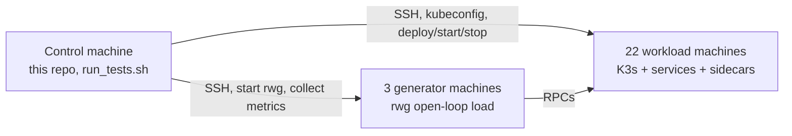

# Roshanfer artifact — EuroSys 2027

This repository is the experiment harness for:

**Roshanfer: Achieving Performance Resilience in Cloud Microservices.** Farzad Mohammadi et al. EuroSys 2027 (paper #1195).

We are applying for the ACM / EuroSys 2027 badges **Available**, **Functional**, and **Reproduced**.

> **Reproduction claim.** We only claim that evaluators can reproduce the paper results if they use our exact setup: CloudLab `c220g2` nodes, 1 control + 3 generators + 22 workload machines, instantiated from our public [small-lan](https://www.cloudlab.us/p/PortalProfiles/small-lan) profile with this parameter set: [rerun_paramset=f369c1b9-2eff-425f-b5ce-d7493a17fd76](https://www.cloudlab.us/p/PortalProfiles/small-lan&rerun_paramset=f369c1b9-2eff-425f-b5ce-d7493a17fd76). Other hardware or a different node count is out of scope.

Work for artifact evaluation happens on branch `artifact-evaluation`.

---

## Time and resource overview

> **TODO (Farzad — you must write this yourself. Do not ship this placeholder.)**
>
> Fill human time and compute time for each step below, after you have actually measured them. Do not invent numbers.
>
> Suggested rows (Padhye-style):
>
> - Getting started / kick-the-tires (one-service tutorial): _? human-min + ? compute-min_
> - Instantiate CloudLab + wait for nodes: _?_
> - Provision K3s + build sidecar: _?_
> - Hotel Reservation paper sweep (`--also-hotel-social`): _?_
> - Social Network paper sweep: _?_
> - Alibaba / DGG 30-MS sweep (`--also-alibaba`): _?_
> - Disk per full campaign: _?_

---

## Architecture (and a bit of repo layout)

Every paper experiment uses three roles.

| Role | Count (paper) | What it is |
| --- | --- | --- |
| **Control** | 1 | The machine where this repo is cloned. Runs `run_tests.sh` / `exec.executor`, holds `KUBECONFIG`, pulls logs, plots. |
| **Generators** | 3 | Run the open-loop load generator (`rwg`). They are *not* in the Kubernetes cluster. |
| **Workload** | 22 | Kubernetes nodes. Microservices + Roshanfer sidecars (or Rajomon / Dagor / plain). |



Host files are ordered: **the first `num_generators` lines are generators; the rest are workload / K8s nodes.** For the paper setup that is 3 + 22.

### What lives where in this repo

| Path | Role |
| --- | --- |
| `run_tests.sh` | Batch entry point. Walks `configs/tests/*`, optionally hotel / social / alibaba. |
| `exec/` | Orchestrator: provision → deploy → generate → collect → plot. |
| `configs/` | Per-benchmark `config.json` + `experiments.json` + optional `merged.yaml`. |
| `benchmarks/` | Submodule. Call graphs, DeathStarBench wrappers, K3s/Cilium scripts, provisioning. |
| `rwg/` | Submodule. Go open-loop HTTP/gRPC generator. |
| `benchmarks/sidecar/` | Nested submodule. Roshanfer C++ sidecar (the system in the paper). |

A **benchmark** is a pair: a bench tree under `benchmarks/` (how to build and deploy the service graph) plus a config tree under `configs/` (what experiments to run on it).

---

## Tutorial: build and run an example from scratch

This is the kick-the-tires path. Goal: instantiate the cluster, clone, install, run **one** small benchmark (`one-service`), and open a plot.

Active time should be a handful of commands. Compute time is **TODO (Farzad)**.

### 1. Instantiate CloudLab

1. Open the exact parameter set: [small-lan rerun_paramset](https://www.cloudlab.us/p/PortalProfiles/small-lan&rerun_paramset=f369c1b9-2eff-425f-b5ce-d7493a17fd76).
2. Instantiate it (do **not** invent a different hardware type or node count).
3. Wait until all nodes are ready.
4. Download the experiment **manifest** XML from the CloudLab portal. You will pass that file to `run_tests.sh`.

AEC access: use SSH keys. Do not send CloudLab passwords. Strip `user@host` from public keys. All discussion goes through HotCRP.

### 2. Clone on the control machine

```bash
git clone --recurse-submodules -b artifact-evaluation <this-repo-url>
cd roshanfer-experiments
git submodule update --init --recursive
```

If you cloned without `--recurse-submodules`:

```bash
git submodule update --init --recursive
```

You need `benchmarks`, `rwg`, and the nested `benchmarks/sidecar`.

### 3. Python env and direnv

`run_tests.sh` uses `.venv/bin/python` if present, otherwise `python`. It **refuses to start** unless direnv has set `KUBECONFIG` to this clone's `benchmarks/k8s/kubeconfig`.

```bash
sudo apt install direnv
echo 'eval "$(direnv hook bash)"' >> ~/.bashrc   # or zsh
source ~/.bashrc
cd /path/to/roshanfer-experiments
direnv allow

python3 -m venv .venv
source .venv/bin/activate
pip install -r requirements.txt
```

(`init_env.sh` currently creates a directory named `env` and leaves `pip install` commented out. Use the commands above until that script is fixed.)

### 4. Manifest → host list

```bash
python -m exec.cloudlab_hosts --manifest ./manifest.xml -o ./cloudlab_hosts.txt --ssh-user YOUR_CLOUDLAB_USER
```

One `[user@]host` per line. Order follows CloudLab `node0`, `node1`, … For paper runs, `--num-generators 3` means lines 1–3 are generators and the remaining 22 are workload.

### 5. What a benchmark directory is

Look at `configs/tests/one-service/`. That is the smallest example:

| File | What it does |
| --- | --- |
| `config.json` | Bench name (`bench: tests/one-service`), SLOs, `num_generators`, paths to `rwg` and hosts. |
| `experiments.json` | List of runs: `type`, `system`, `loads`, `duration_sec`, `apis`, `repeat`. |
| `merged.yaml` | How to overlay systems on one figure (Plain vs Roshanfer). |
| `hosts.txt` | Local-mode hosts only. **Ignored** when you pass `--remote` (the manifest wins). |

`config.json` for this example (the knobs you will actually edit):

```json
{
  "bench": "tests/one-service",
  "num_generators": 1,
  "slos": { "f1": "20" },
  "rwg_binary_path": "./rwg/rwg"
}
```

`experiments.json` entries are the experiment types (see the next section). A minimal sidecar latency sweep looks like:

```json
{
  "type": "latency-vs-throughput",
  "system": "sidecar",
  "apis": ["f1"],
  "loads": { "start": 500, "end": 2000, "step": 500 },
  "base_rate": 500,
  "duration_sec": 10,
  "repeat": 1,
  "warmup": 2
}
```

`system` is `plain` (no sidecar), `sidecar` (Roshanfer), `rajomon`, or `dagor`.

To **build a new example benchmark**, copy this directory:

```bash
cp -r configs/tests/one-service configs/tests/my-example
# edit configs/tests/my-example/config.json   (bench, slos, num_generators)
# edit configs/tests/my-example/experiments.json
# if you need a new service graph, add it under benchmarks/ and point bench at it
```

Then run only that bench with `--bench my-example`.

### 6. Run the example

Paper-faithful remote run of `one-service` only:

```bash
./run_tests.sh \
  --bench one-service \
  --remote \
  --cloudlab-manifest ./manifest.xml \
  --num-generators 3 \
  --cloudlab-ssh-user YOUR_CLOUDLAB_USER \
  --comment kick-the-tires
```

`--num-generators 3` is the paper split. The `one-service` config itself defaults to 1 generator if you omit the flag.

What this does:

1. Parses the manifest into `exp_runs_test/<run_id>/cloudlab_hosts.txt`.
2. Runs `python -m exec.executor` for `configs/tests/one-service/`.
3. Writes data under `exp_runs_test/<run_id>/one-service/`.
4. Plots to `exp_runs_test/<run_id>/plots/one-service/` and a merged PDF under `plots/`.

`<run_id>` is `YYYYMMDD_HHMMSS` plus an optional `_comment`. A second run creates a **new** folder. It does not overwrite the first.

### 7. Check results and plots

```bash
ls exp_runs_test/*/one-service/exp-one-service/
ls exp_runs_test/*/plots/one-service/
ls exp_runs_test/*/plots/all_tests_plots.pdf
```

Per-repeat metrics live under `…/repeat_000/output/` (`overall-*.json`, `realtime-*.csv`). Merged overlays (Plain vs Roshanfer) are under `plots/one-service/merged/` when `merged.yaml` is present.

If filters excluded everything, `run_tests.sh` skips plots and says so.

Missing arguments print `Usage:` and exit. Unknown flags do the same.

---

## Experiment types and important configs

`run_tests.sh --type` and each `experiments.json` `type` field use these names.

| Type | What it measures | Typical paper use |
| --- | --- | --- |
| `latency-vs-throughput` | Latency vs offered load while the system is not in the overload-control regime | Fig. 14-style overhead vs Plain |
| `latency-and-goodput-vs-load` | P99 / goodput as load rises through and past capacity | Figs. 7, 11, 12, 13 |
| `latency-and-rate-vs-time` | Time series after a load spike (P99 and rates in 200 ms windows) | Fig. 8, motivation Figs. 1–2 |
| `max-queue` / `max-queue-motivation` | Per-service queue depths under overload | Figs. 1b, 10 |
| `resource-waste` | Fraction of work that is later dropped or misses SLO | Figs. 2b, 9 |

**Knobs that change the claim** (edit these; ignore the rest until you have to):

- `system`: `plain` \| `sidecar` \| `rajomon` \| `dagor`
- `apis`: which entry APIs are driven (e.g. `search-hotel`, `compose-post`, `f1`)
- `loads.start` / `end` / `step`: offered load grid (RPS)
- `duration_sec`, `warmup`, `repeat`
- `slos` in `config.json` (paper rule: 5× unloaded P99)
- `num_generators` / `--num-generators`
- `--also-hotel-social` and `--also-alibaba` (paper benches; **not** in the default `configs/tests/*` walk)

Default `./run_tests.sh` only runs `configs/tests/*` (synthetic graphs). Paper figures need:

```bash
./run_tests.sh --remote --cloudlab-manifest ./manifest.xml \
  --num-generators 3 --cloudlab-ssh-user YOUR_CLOUDLAB_USER \
  --also-hotel-social --also-alibaba
```

Or one bench at a time: `--bench hotel --also-hotel-social`, `--bench social --also-hotel-social`, `--bench alibaba-large --also-alibaba`.

---

## Artifact map

| Component | Where | Paper |
| --- | --- | --- |
| Roshanfer sidecar (Agent + Ingress, credit protocol) | `benchmarks/sidecar/` | Design and implementation (§3–§5) |
| Experiment orchestrator | `exec/`, `run_tests.sh` | Evaluation (§6) |
| Open-loop generator | `rwg/` | §6.1 |
| Hotel Reservation / Social Network | `configs/hotel/`, `configs/social/` + `benchmarks/` | Figs. 7–11, 14 |
| Alibaba / DGG 30-MS and dynamic graphs | `configs/alibaba-large/`, `configs/tests/dynamic-large/`, `fan-out-dynamic-*` | Figs. 12–13 |
| Rajomon / Dagor baselines | `system: rajomon` / `dagor` in `experiments.json` | §6 baselines |
| TLA+ model | **TODO (Farzad — you must write this yourself. Do not ship a guessed URL.)** | §5, Request Bound / Deadlock Freedom / Work Conservation |

---

## Exact environment

| Item | Paper / AE value |
| --- | --- |
| CloudLab profile | [PortalProfiles/small-lan](https://www.cloudlab.us/p/PortalProfiles/small-lan) |
| Exact parameter set | [rerun_paramset f369c1b9-2eff-425f-b5ce-d7493a17fd76](https://www.cloudlab.us/p/PortalProfiles/small-lan&rerun_paramset=f369c1b9-2eff-425f-b5ce-d7493a17fd76) |
| Hardware | CloudLab **`c220g2`** |
| Roles | 1 control + 3 generators + 22 workload |
| Cluster | K3s + Cilium, scripts in `benchmarks/k8s/` (`K3S_VERSION` and `CILIUM_VERSION` in `benchmarks/k8s/config.env`) |
| Sidecar build | C++, `ubuntu:noble` in the sidecar Dockerfile |
| Python | `requirements.txt` (pinned) |
| Control OS assumption | Linux with SSH, direnv, Python 3, the venv above |

We do **not** claim results on a laptop, a different CloudLab type, or a different node count.

---

## Figure → command

Commands assume you already did the tutorial through “manifest → host list”.

| Paper figure | Bench | Type | Systems | How to run |
| --- | --- | --- | --- | --- |
| Fig. 7 | `hotel` (`search-hotel`), `social` (`compose-post`) | `latency-and-goodput-vs-load` | sidecar, rajomon, dagor | `--bench hotel --also-hotel-social` and `--bench social --also-hotel-social` |
| Fig. 8 | `hotel` | `latency-and-rate-vs-time` | sidecar, rajomon, dagor | same hotel command |
| Fig. 9 | `hotel` / `social` | `resource-waste` | sidecar, rajomon, dagor | same |
| Fig. 10 | `hotel` / `social` | `max-queue` | sidecar, rajomon, dagor | same |
| Fig. 11 | `social` (3 APIs) | `latency-and-goodput-vs-load` | sidecar, rajomon, dagor | `--bench social --also-hotel-social` |
| Fig. 12 | dynamic graph tests | `latency-and-goodput-vs-load` | sidecar, rajomon, dagor | `--bench dynamic-large` or `fan-out-dynamic-0-9` |
| Fig. 13 | `alibaba-large` | `latency-and-goodput-vs-load` | sidecar, rajomon, dagor | `--bench alibaba-large --also-alibaba` |
| Fig. 14 | `hotel` | `latency-vs-throughput` | plain, sidecar | `--bench hotel --also-hotel-social` |
| Figs. 1–2 (motivation) | `hotel` | `latency-and-rate-vs-time`, `max-queue-motivation`, `resource-waste` | rajomon | `--bench hotel --also-hotel-social` |

Farzad: please check this table against the paper before we freeze it. Fig. 15 (overcommitment / WRR) may need its own config; it is not wired as a `--bench` name above.

Plots: `exec.plot_runner` + `exec.merged_plot_runner` using each bench’s `merged.yaml` (labels Roshanfer / Rajomon / Dagor / Plain).

Re-run: a new `exp_runs_test/<timestamp>/` directory. The executor **appends** extra `repeat_*` folders if you point it at an existing unit directory. Prefer a fresh `run_tests.sh` invocation.

### Expected warnings and errors

> **TODO (Farzad — you must write this yourself. Do not ship this placeholder.)**
>
> Walk every command an evaluator will run (CloudLab instantiate, clone, direnv, venv, manifest parse, `one-service`, hotel/social/alibaba). For each step, list:
>
> - lines that look like errors but are normal
> - real failures and what to do
> - what a successful run prints
>
> This is a big item. Do not guess.

---

## Troubleshooting

> **TODO (Farzad — you must write this yourself. Do not ship this placeholder.)**
>
> Same careful pass as expected warnings. Cover at least: direnv / KUBECONFIG refusal, SSH user mismatch, submodule not initialized, provision marker `~/.roshanfer_provisioned`, `--remote-clean`, empty plot skip, Rajomon tuner hours.
>
> This is a big item. Do not guess.

---

## License

License files are not in the tree yet. Planned: a license that allows comparison and extension (MIT or CC-BY), required for Available.

---

`exec/README.md` is the longer operator manual (tuners, worktrees, plot flags). This file is the evaluator path.
